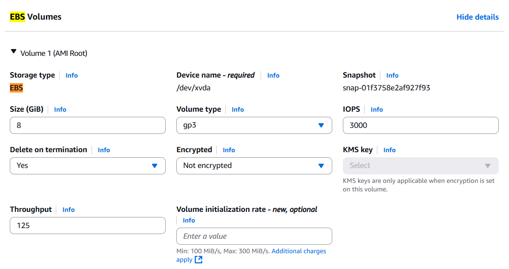

### Elastic Block Store(EBS)
EBS is a network drive you can attach to your instances while they run, then it will allow the instance to persist data even after their termination

#### Analogy
- think of them as a USB stick

#### Features
- they're bound to a specific AZ as well as ENI or EC2
- they can only mounted to one instance at a time (at the CCP level)
- they can be attached to one instances at a time like "ebs * - 1 ec2"
- handy since it can be easily attached and detached to/from an ec2 instance
- as you can see, you can decide whether not to delete ebs volume on termination of your instance (img1)
- by default, the root EBS volume is deleted unlike any other attached ebs volumes
- you can check ebs volumes attached to your instance by running the following commands
```bash
lsblk

# lsblk will list block devices attached to your machine.
# currently, it prints 2 devices(=ebs volumes), "nvme0n1" and "nvme1n1"

# outputs
# NAME          MAJ:MIN RM SIZE RO TYPE MOUNTPOINTS
# nvme0n1       259:0    0   8G  0 disk 
# ├─nvme0n1p1   259:1    0   8G  0 part /
# ├─nvme0n1p127 259:2    0   1M  0 part 
# └─nvme0n1p128 259:3    0  10M  0 part /boot/efi
# nvme1n1       259:4    0   2G  0 disk 
```
- you can check disk space usage of file systems.
```bash
df -h
# -h option displays sizes in a human-readable format (e.g., gb, mb).
# outputs
# Filesystem        Size  Used Avail Use% Mounted on
# devtmpfs          4.0M     0  4.0M   0% /dev
# tmpfs             3.9G     0  3.9G   0% /dev/shm
# tmpfs             1.6G  436K  1.6G   1% /run
# /dev/nvme0n1p1    8.0G  3.5G  4.5G  45% /
# tmpfs             3.9G  2.4M  3.9G   1% /tmp
# /dev/nvme0n1p128   10M  1.3M  8.7M  13% /boot/efi
# tmpfs             782M     0  782M   0% /run/user/1000
```

#### Terms
- efi (EFI partition): EFI partition stores boot files used by the system firmware to start the OS in UEFI mode.
- Firmware: Low-level software in hardware (like BIOS/UEFI) that starts your computer and loads the OS.
- UEFI mode: Modern firmware mode that replaces BIOS; it supports faster boot, larger disks, and secure boot.
- device name (like /dev/xvda or /dev/sdf): the internal identifier for the EBS volume inside the EC2 instance, shown in commands like lsblk.


#### imgs



