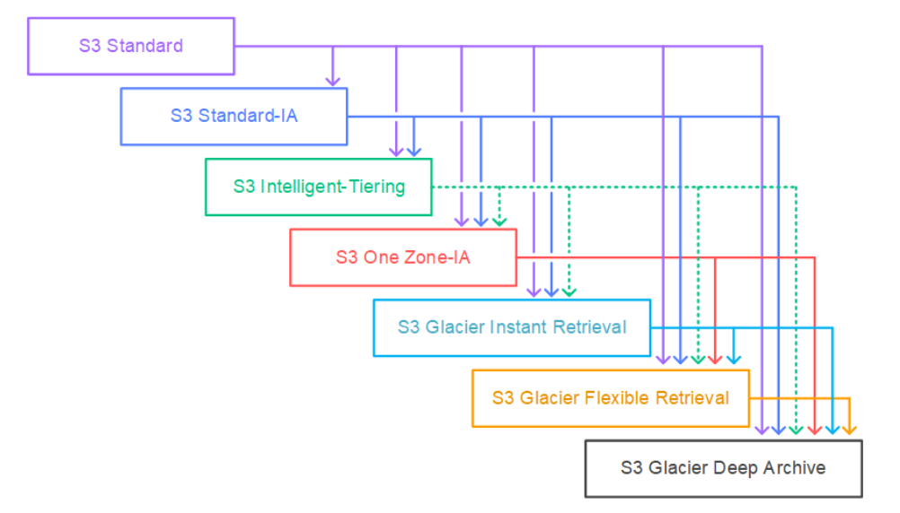

## S3 Storage Classes
short explanation comes here

### Features
#### general
- you can choose class at creation of an "object"
- you can move the object between each class in your bucket manually or using **s3 lifecycle configuration**

#### durability and availability
- durability
    - high durability (99.9999999999%, || 9's) of objects across multi AZs
    - if you store 10 milion objects within amazon s3 bucket, you can expect to incur a loss of a single object once every 10,000 years on average
    - same for all storage classes
- availability
    - measures how readily available a service is
    - varies depending on the storage class
    - e.g., s3 standard has 99.99% availability = not available 53 minutes a year

#### storage classes
- [amazon s3 standard - general purpose][general-purpose]
- [amazon s3 infrequent access][infrequent-access]
- [amazon s3 glacier][glacier]
- [amazon s3 intelligent tiering][intelligent-tiering]

#### [Lifecycle Rules][lifecycle-rules]

### References
[aws storage classes](https://aws.amazon.com/s3/storage-classes/)
[lifecycle-transition](https://docs.aws.amazon.com/AmazonS3/latest/userguide/lifecycle-transition-general-considerations.html)

[general-purpose]: ./s3-storage-classes/general-purpose.md
[infrequent-access]: ./s3-storage-classes/infrequent-access.md
[glacier]: ./s3-storage-classes/glacier.md
[intelligent-tiering]: ./s3-storage-classes/intelligent-tiering.md
[lifecycle-rules]: ./s3-lifecycle-rules.md

